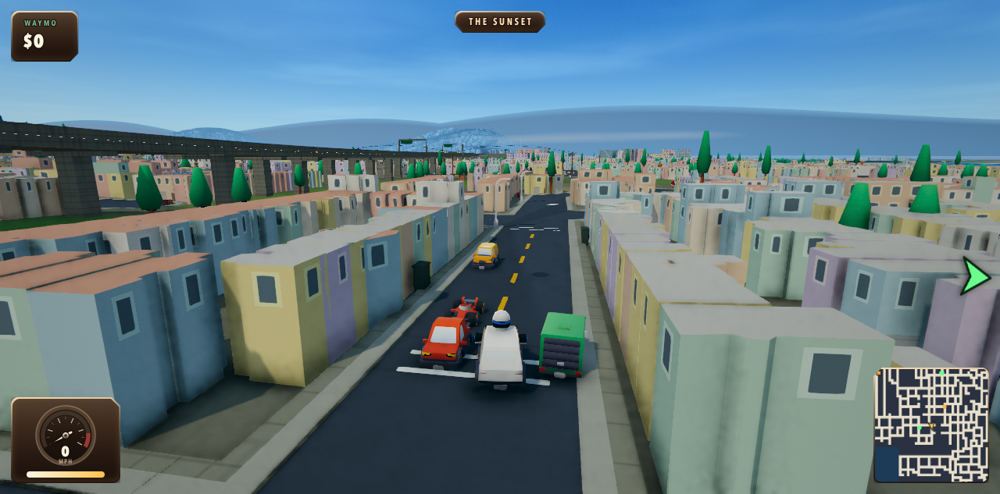
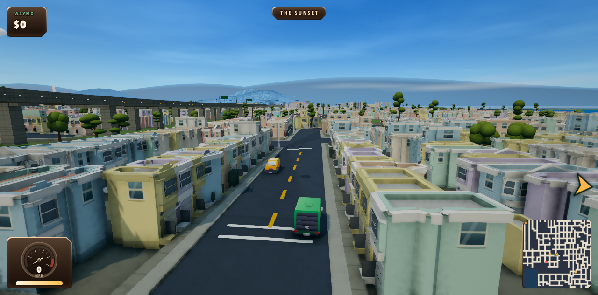

# San Francisco studio pass

An environment, rendering and driving overhaul. Generated references inform the typed Three.js assets; the playable city keeps its real SF street network and parcel footprints.

## What changed

- Six district building families: Victorian bays and corner roofs; pastel avenue garages; Chinatown lanterns and fire escapes; North Beach masonry and striped awnings; brick industrial sheds and sawtooth roofs; downtown podiums, glass curtain walls, horizontal office ribbons and stone towers. Named storefronts share one small atlas.
- Dimensional Salesforce Tower: curved glazing, silver sunshades and fins, recessed lobby and illuminated crown. [Reference, specification and renders](../salesforce/README.md).
- Disjoint asphalt, curbs and sidewalks. Markings follow actual road triangles; terrain stays beneath the road. Nearby towers no longer draw two incompatible window patterns. Fully enclosed duplicate source buildings are filtered before streaming.
- Image-referenced SF trees and red-canopy Muni shelters. Exact parcel clearance covers shelter geometry and full tree stems; park trees have colliders at their visible roots. Construction scaffolds align with the street and use open backing.
- Rounded 3D clouds, readable night streets, restrained window light, grounded skid/smoke/boost effects, and road-seated lamp pools.
- Hill parking, bridge-aware camera clearance, terrain framing, complete-scene startup readiness, portrait HUD spacing and real touch controls. Hidden title controls become inert so they cannot steal steering touches or keyboard focus.

## Verification

**Revision 90 is installed.** All 172 game checks, all 11 repository test tasks, all 24 typecheck tasks, repository lint, formatting and the production build pass. The worker test formatting failure is fixed. [Release validation](release-validation.json). The earlier [140-check log](game-tests-90.log) records the environment pass before mobile cleanup.

The final [desktop report](report.json) passes all nine checks; the [mobile report](mobile/report.json) passes all 14. Both report zero page errors. Current gameplay screenshots below are revision 90. Earlier production/reference evidence retains its own explicit revision label.

The desktop rehearsal uses held keyboard input and live Rapier physics for acceleration, braking, boost and drift. It stages real pickup/dropoff positions to verify fare payment; it does not claim autonomous route completion. It also checks pause/restart, hill parking and camera clearance.

The mobile rehearsal keeps a CDP session attached for actual coarse-pointer rendering and multitouch input at 390×844 and 844×390. Acceleration, steering, boost, drift, reverse, pause/resume/restart and HUD bounds are checked. [Mobile performance evidence](mobile-performance/README.md) adds DPR 3, sustained native touch driving, CPU throttling and a measured first quality transition. [iOS Safari evidence](mobile-ios/README.md) covers the Safari engine in an iPhone simulator. Physical phone GPU performance remains unmeasured.

[Environment-pass production smoke](production-90.json) confirms its built bundle, matching world artifacts, ready title, native Start/countdown, night rendering and absence of developer hooks. It precedes the mobile performance cleanup. [Night capture](production-night-90.png).

[Production revision 89 evidence](production-89.json) separately verifies native controls without developer hooks, clean braking from 21 to 0 mph, a ready title, readable night streets, and zero browser warnings/errors. It precedes the final landmark, tower and scaffold art revisions.

Road fixture audit: zero terrain penetrations across 212,454 samples and zero buried paint samples across 4,753 samples. Tree audit: zero intersecting full-stem envelopes across 18,712 stems; 99.77% of park stems retained and all 2,288 embedded roots have matching colliders. See [tree clearance](remaining.md) and the [installed scaffold audit](scaffold-audit-90.json).

Building allocations, including skyline and shared sign atlas: 44.17 MiB desktop / 22.92 MiB phone in Financial District; 108.95 MiB / 57.06 MiB in Richmond. These remain within the original 110 MiB / 70 MiB budgets. They are building allocations, not total GPU memory or frame-rate measurements.

The phone's highest quality tier now respects its fabric budget; the previous expansion reached 81.18 MiB. Static city transforms and opaque prop draw lists are reused. Both shadow variants warm before play, removing a measured six-second first downgrade stall. Quality sampling uses a two-second window and retains sustained slow frames. Cleanup removed dead road seating code, fixed browser-session disposal, and trimmed 10.87 MiB of redundant art evidence.

[Restart and underpass recovery](recovery/README.md): safe starts validate the full opening route; camera clearance traces toward the taxi body instead of its wheel contact point. Native restart verification requires actual movement and a clear chase camera.

## Visual evidence

### Same-camera Sunset comparison

Original:

Dimensional facade pass (revision 87; traffic differs):

The comparison documents the facade change; current-world views and reports carry their own revision below.

[Desktop report](report.json) · [Sunset](sunset-noon.png) · [Haight](haight-noon.png) · [Chinatown](chinatown-noon.png) · [North Beach](north-beach-golden.png) · [Dogpatch](dogpatch-noon.png) · [Downtown](downtown-noon.png) · [Night](downtown-night.png)

[Phone portrait at night](mobile/portrait-night.png) · [Phone landscape at night](mobile/landscape-night.png) · [Phone downhill framing](mobile/landscape-noon.png)

Art direction and provenance: [architecture](../architecture/README.md), [trees](../trees/spec.json), [Muni shelter](../muni-shelter/README.md), [Salesforce Tower](../salesforce/README.md).

## Practical limits

Visual quality still needs a human driving session. Physical phone GPU performance and multiplayer were not part of these offline browser rehearsals. CPU-throttled desktop results and simulator compatibility do not establish a real phone's frame rate.

[Play Crazy Waymo](https://crazy-waymo.vibedgames.com). Game releases upload the verified `dist` bundle through `vg deploy`; platform Workers deploy separately through GitHub Actions.
