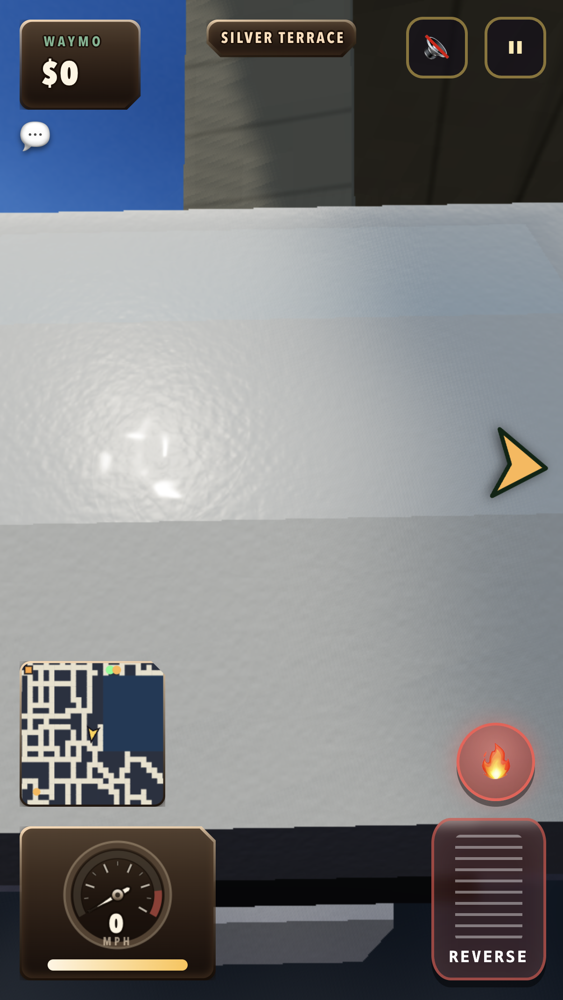
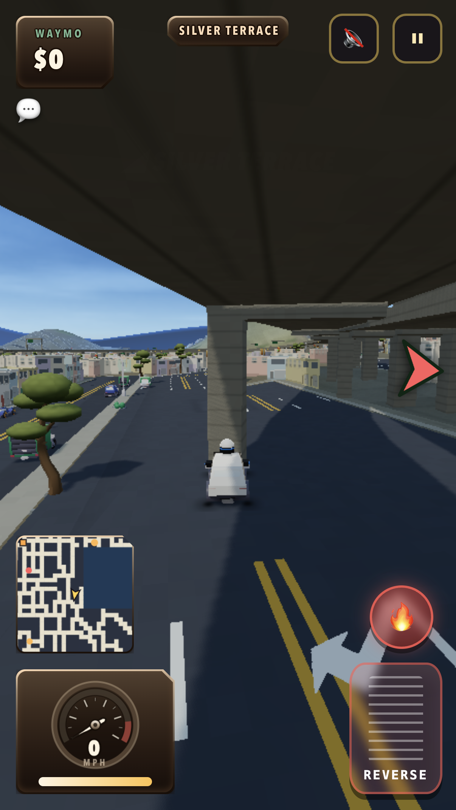

# Restart and underpass recovery

Native Safari testing found a random Silver Terrace start facing a freeway support, with the chase camera compressed into the taxi roof. The coordinates were recovered from the rendered minimap: x 624.288, z 309.164, heading -0.15595 radians. Chrome reproduced both the obstructed route and the camera failure.

The camera now traces clearance from the taxi's body height. A ray from the wheel contact point falsely required a steep rise immediately behind the car; the low soffit blocked that rise and shortened the boom. At the same settled pose, horizontal camera distance increased from **2.08u to 13.00u**, while remaining below the overhead structure. [Measured comparison](camera-comparison.json).

Both images use Chrome's coarse-pointer path at 402 × 714 CSS pixels, DPR 3, with the car staged at the recovered location. They verify camera framing, not a drive through the support.

New starts validate 80u ahead and 35u behind: asphalt support, moderate grade, cross-slope, continuous obstacle clearance, freeway exclusion and elevated-deck exclusion. Actual starts revalidate against the completed city's solids. The fallback searches validated street candidates; no unchecked grid position remains.

The installed-world audit found 181 directed midpoint candidates across 24 districts. All 64 seeded selections passed, yielding 59 distinct origins across 15 districts. Warm selection median / p95 was 0.8 / 2.1 ms; the first selection included about 396 ms of existing lazy terrain initialization during loading. Sixteen spawn checks cover thin/rotated obstacles, camera approach, unsupported roads, grade, bridge structures, full-city revalidation and exhausted candidates.

Three camera regressions cover low underpasses with settled wheel-root heights of 0.02 / 0.1 / 0.3u. Existing convex-hill and bridge floor/ceiling checks also pass. The [14-check mobile suite](../mobile/report.json) now drives from the selected restart position: more than 30u of travel, speed above 15u/s and camera distance above 6u. The final run reached 30.2u/s with a clear camera. Physical-phone GPU and thermal behavior remain unmeasured.
